<h1 align="center">
  UTS Pemrograman Web CR002 <br>
  Portofolio & Progress Project Akhir
</h1>

<p align="center">
  Website portofolio personal dan showcase progress project akhir berbasis Laravel 12 + Filament Admin Panel.
</p>

---

<p align="center">


</p>

<p align="center">


</p>

---

# Tentang Project

Repository ini merupakan project **Ujian Tengah Semester (UTS) Mata Kuliah Pemrograman Web** yang dibuat menggunakan framework Laravel 12.

Aplikasi ini berfungsi sebagai:

- Website Portofolio Personal
- Showcase Progress Project Akhir
- Dashboard Admin Dinamis
- Sistem CRUD Project
- Contact Form Integration
- Monitoring Progress Project

---

# Fitur Utama

## Frontend Website

- Landing page modern
- Responsive design
- Dynamic showcase project
- Dynamic kategori project
- About & Tech Stack
- Detail project page
- Contact form
- Social media integration

---

## Dashboard Admin Filament

Admin panel digunakan untuk mengelola:

- CRUD Project
- CRUD Progress Project
- CRUD Pesan Kontak
- Upload ERD & Flowchart
- Upload PDF laporan
- Dynamic Tech Stack
- Dynamic kategori project
- Progress monitoring

---

## Progress Project System

Menampilkan:

- Persentase progress
- Status pengerjaan
- Progress bar dinamis
- Dashboard chart
- Timeline pengerjaan project

---

## Detail Project

Setiap project memiliki halaman detail berisi:

- Judul project
- Deskripsi lengkap
- Analisis masalah
- Kebutuhan sistem
- Tech stack
- ERD
- Flowchart
- Progress project
- File laporan PDF

---

# Konsep yang Digunakan

Project ini menerapkan beberapa konsep pengembangan web modern:

- MVC (Model View Controller)
- CRUD System
- Relational Database
- Dynamic Content
- Admin Panel
- File Upload Management
- REST Concept
- Responsive Web Design

---

# Tech Stack

| Teknologi | Keterangan |
|---|---|
| Laravel 12 | Backend Framework |
| PHP 8 | Bahasa Pemrograman |
| Blade | Template Engine |
| Filament | Admin Panel |
| Docker | Container Development |
| MariaDB | Database |
| Nginx | Web Server |
| Bootstrap | Frontend UI |
| GitHub | Version Control |
| VS Code | Code Editor |

---

# Struktur Database

Tabel utama yang digunakan:

```text
projects
project_progress
profiles
contact_messages
users
roles
```

---

# Diagram Sistem

Project ini dilengkapi dengan dokumentasi diagram sistem:
```text
✅ Use Case Diagram
✅ Activity Diagram
✅ Entity Relationship Diagram (ERD)
✅ DFD Level 0
✅ DFD Level 1
✅ Flowchart Sistem
```

---

# Dokumentasi Laporan

Repository ini juga menyertakan laporan project akhir dalam format PDF.

Isi laporan meliputi:
```text
BAB I Pendahuluan
BAB II Studi Teoritis
BAB III Metodologi Penelitian
BAB IV Hasil dan Pembahasan
BAB V Penutup
```

---

# Screenshot Aplikasi

## Landing Page

### Home
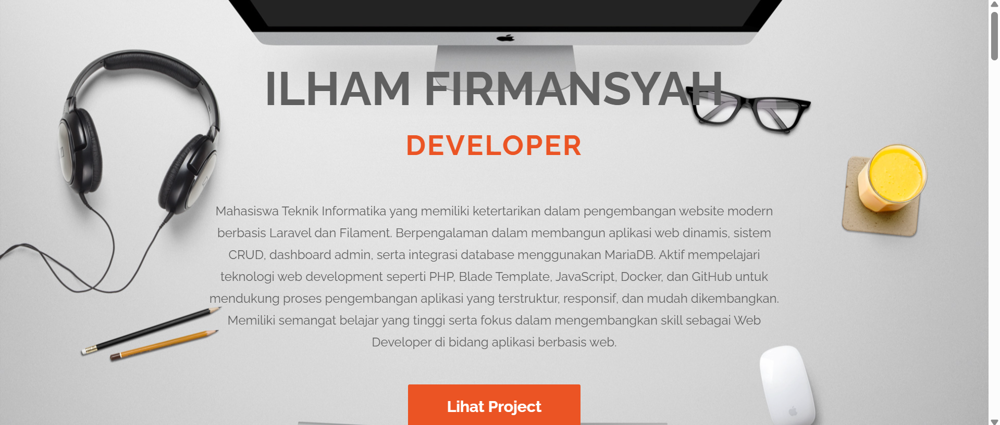
### Areas of Expertise
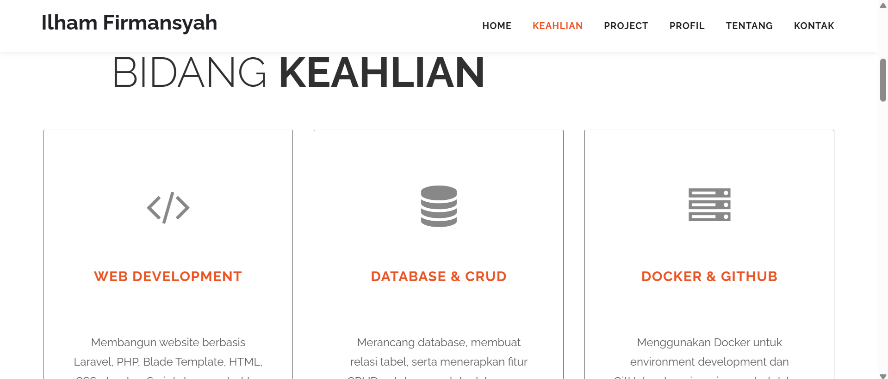
### Showcase Project
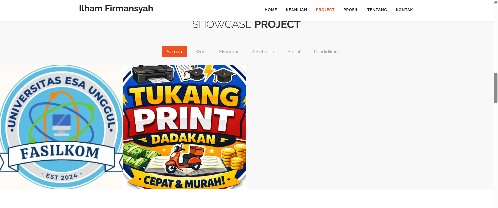
### Profile and Tech Stack
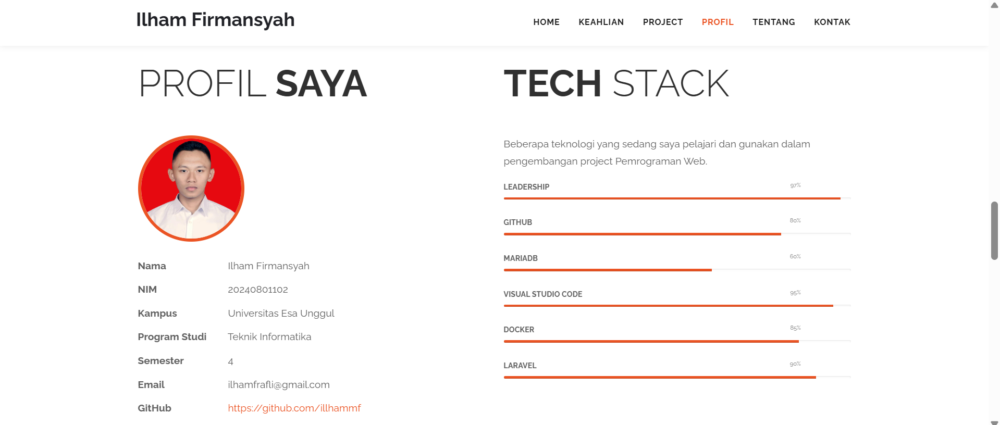
### About and social media
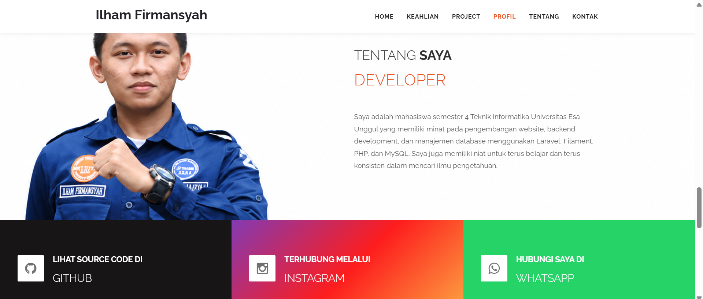
### Contact Me
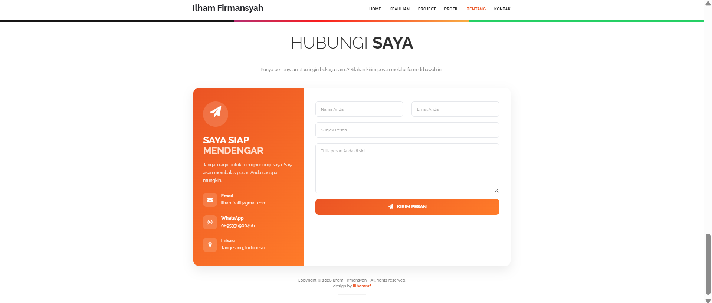


## Detail Project Page

### Detail Project Header
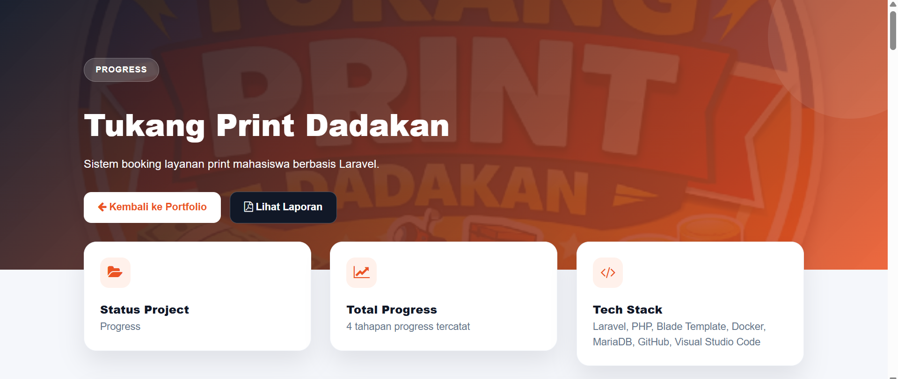
### Analisis Sistem
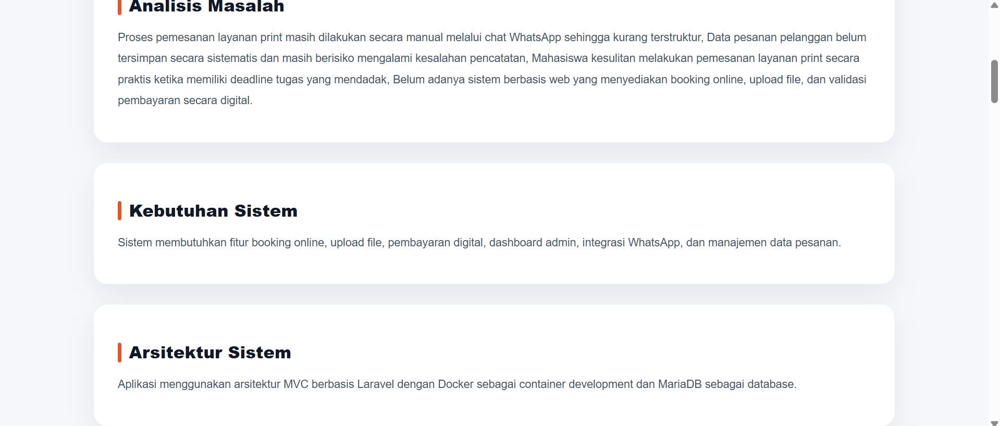
### Tech Stack and Progress Project
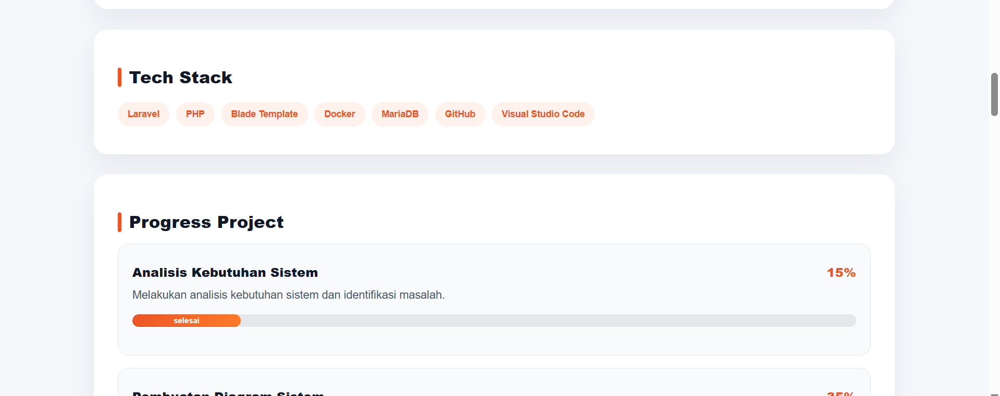
### Progress Project
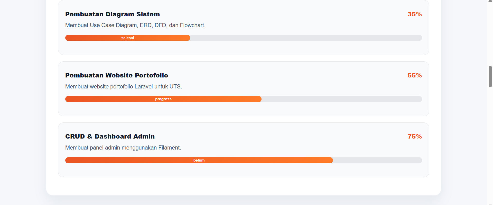
### ERD
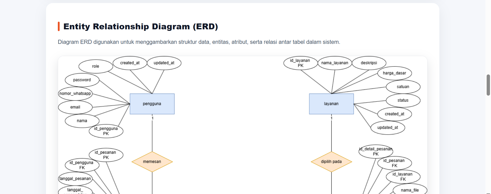
### Flowchart
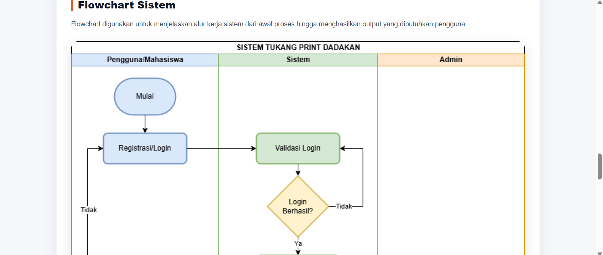
### Laporan
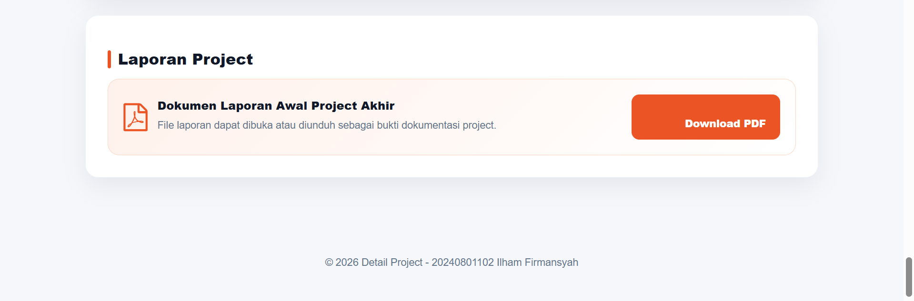

---

# Dashboard Admin

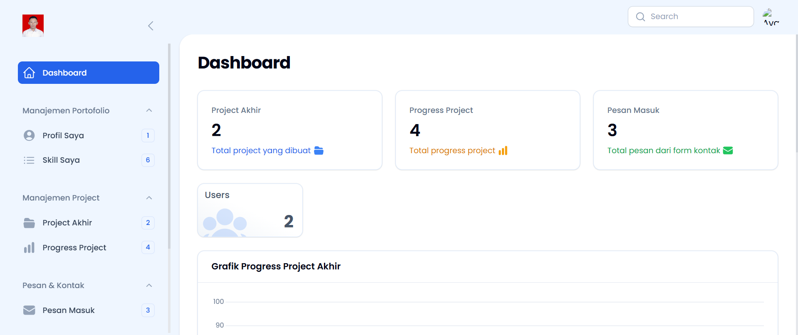

---

# Cara Menjalankan Project
1. Clone Repository
```sh
git clone https://github.com/illhammf/uts-2026.git
```
2. Masuk ke Folder Project
```sh
cd root/perkuliahan/uts-2026
```
3. Jalankan Docker
```sh
docker compose up -d
```
atau menggunakan helper command:
```sh
dcu
```
4. Install Dependency
```sh
composer install
npm install
```
5. Konfigurasi Environment
```sh
cp .env.example .env
php artisan key:generate
```
6. Jalankan Migration & Seeder
```sh
php artisan migrate:fresh --seed
```
atau:
```sh
dca project:init
```
7. Jalankan Development Server
```sh
npm run dev
```

## Admin Panel
```sh
https://uts.test/admin
```
username:
```sh
admin@admin@.com
```
password:
```sh
password
```
dan jika ingin mematikannya
```sh
dcd
```

---

# Informasi Mahasiswa
| Data |	Keterangan |
|---|---|
| Nama |	Ilham Firmansyah |
| NIM |	20240801102 |
| Program | Studi	Teknik Informatika |
| Fakultas |	Ilmu Komputer |
| Universitas |	Universitas Esa Unggul |
| Angkatan |	2024 |

---

# License

Project ini menggunakan lisensi MIT.

---